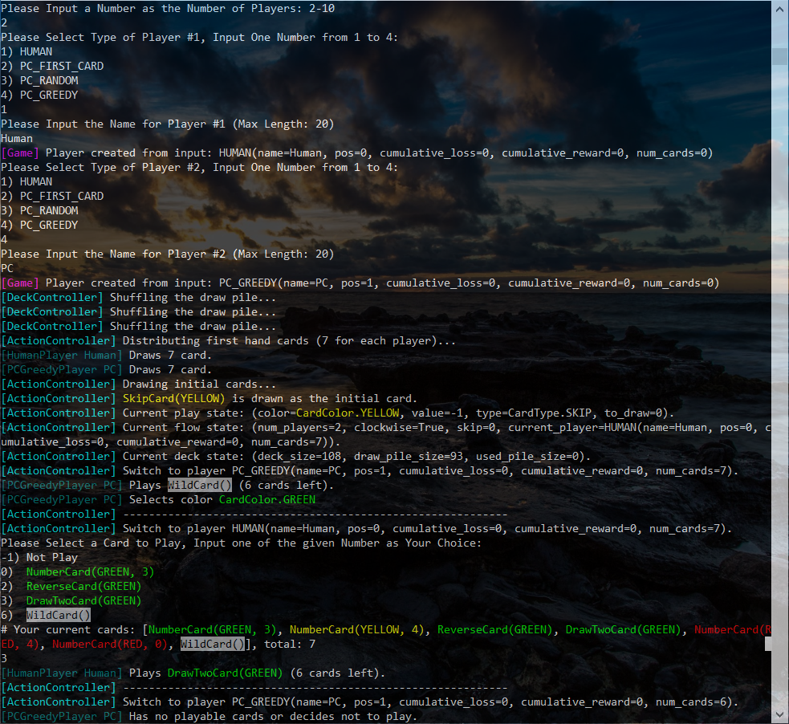
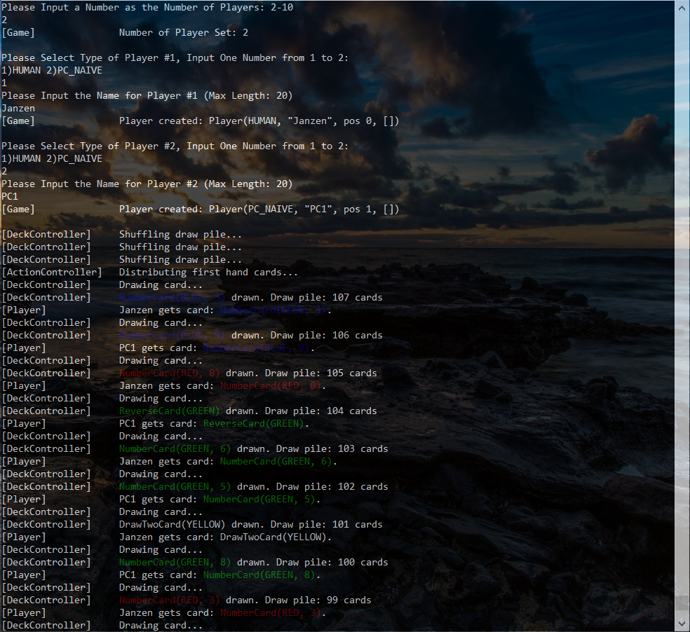

# UNO Game

All version are implemented in Python 3, so note that running them with Python 2 will not work

## Version 2

### Prerequisite
* `colorama`: Python package, install it by `pip3 install colorama` or something

### Run
* To play it, run `run_game_v2_play.py`, then you can enjoy playing with other human players or PC players that you choose
* To simulate game and collect data (all players are PC), run `run_game_v2_simulate.py`

### Snapshot

## Version 1

### Prerequisite
* `colorama`: Python package, install it by `pip3 install colorama` or something

### Run
* To play it, run `game_v1.py`

### Snapshot

